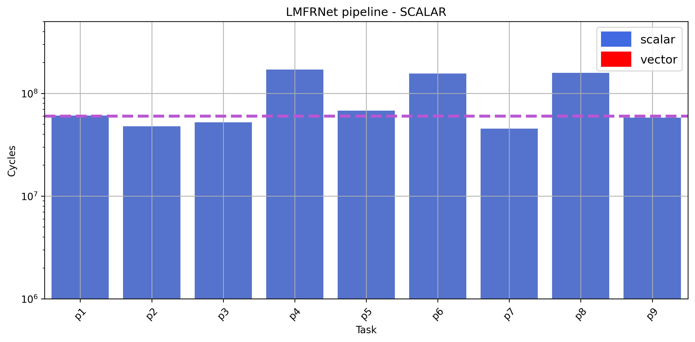
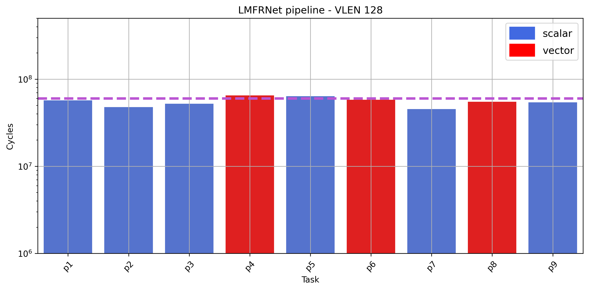

# LMFRNet throughput study (NoC)

## Scalar and homogeneous NoC (5x2)

     
    <em> Figure 1: LMFRNet scalar pipeline.</em>

## Vector and heterogenous NoC (5x2, VLEN 128)

     
    <em> Figure 2: LMFRNet v128 pipeline.</em>

## Results

| inference | class |    val    | throughput (scalar) | throughput (v128) |
| :-------: | :---: | :-------: | :-----------------: | :---------------: |
| 1         | 3     | 131004    | 860                 | 521               |
| 2         | 8     | 142567    | 184                 | 68                | 
| 3         | 8     | 92677     | 184                 | 68                |
| 4         | 0     | 80960     | 184                 | 68                |
| 5         | 6     | 134271    | 184                 | 68                |
| 6         | 6     | 107488    | 184                 | 68                |
| 7         | 1     | 77408     | 184                 | 68                |
| 8         | 6     | 131482    | 184                 | 68                |
| 9         | 3     | 118763    | 184                 | 68                |
| 10        | 1     | 98271     | 184                 | 68                |
| 11        | 0     | 97144     | 184                 | 68                |
| 12        | 9     | 150999    | 184                 | 68                |
| 13        | 5     | 106712    | 184                 | 68                |
| 14        | 7     | 130945    | 184                 | 68                |
| 15        | 9     | 122314    | 184                 | 68                |
| 16        | 8     | 78581     | 184                 | 68                |
| 17        | 5     | 143370    | 184                 | 68                |
| 18        | 7     | 124937    | 184                 | 68                |
| 19        | 8     | 137609    | 184                 | 68                |
| 20        | 6     | 154208    | 184                 | 68                |

The computation inside each task is performed sequentially. Therefore, the first image has the same latency (or close enough) to the single core execution. From the second image and onwards the latency is given by the __slowest tasks__, ~184 M and ~68 M cycles respectively (expected because of the figures above). 

## Hypothetically

- Less area, power and energy in a real heterogeneous architecture
- Infinite memory
- Zero communication overhead (from the experiments, I noticed it is considerably small &rarr; __would be nice to have the actual measure__)
- Probably better results with lower precision (__TO DO__)
- Other vector params...